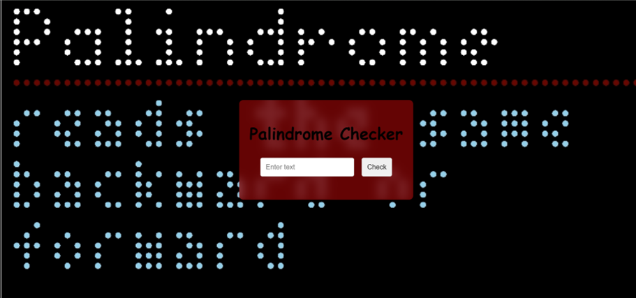

# Palindrome Checker 🚀

## Add functionality to check if an input is a palindrome, with input validation and dynamic result display.📝

> This project is a web application built with HTML, CSS, and JavaScript that checks if a given input is a palindrome by removing non-alphanumeric characters, normalizing the case, and dynamically displaying the result, making it useful for education, coding practice, and fun.

```css
input,
button {
  padding: 10px;
  margin: 5px;
  border-radius: 4px;
  border: 1px solid #ccc;
}
```
```javascript
function hideGifs() {
  document.getElementById('correct-gif').style.display = 'none';
  document.getElementById('incorrect-gif').style.display = 'none';
}
```

## Demo 📸
[live Demo] (https://elhamy786.github.io/Palindrome_Checker/)


## Technologies Used 🛠️

- HTML
- CSS
- JavaScript

## Installation 💻

```bash
1: Clone the Repository:
git clone https://github.com/elhamy786/Palindrome_Checker.git
```

```bash
2: Navigate to the Project Directory:
cd Palindrome_Checker
```

```bash
3: Open the index.html File in Your Browser.
```

## Usage 🎯

```bash
To use the project, open index.html in your browser, ensure style.css and script.js are in the same directory, enter text in the input field, click "Check", and view the palindrome result.
```

## Features ⭐

- Real-time Input Validation: Alerts users if no input is provided.
- Dynamic Result Display: Instantly shows whether the input is a palindrome or not, providing immediate feedback.
- User-Friendly Interface: Clean and simple design for easy interaction.

## Author 👩‍💻
- [Linkedin](https://www.linkedin.com/in/elham-afzali-05326130b?utm_source=share&utm_campaign=share_via&utm_content=profile&utm_medium=ios_app)
- [Email](elham.afzali1383@gmail.com)

## Contributing 🤝
To contribute, submit bug reports, feature requests, or pull requests via the GitHub repository issues and pull requests tabs.